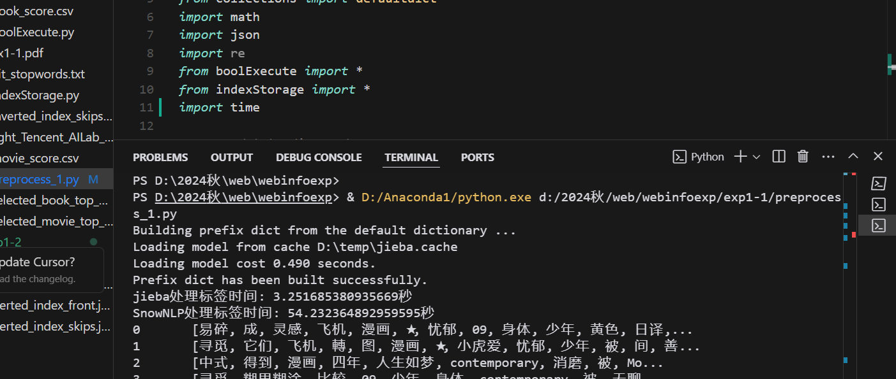

# web信息第一次实验报告

PB21061293 朱其辉

PB21020535 谢卓宇

PB21020522 赵振伟

## exp1-1

### 实验方法与关键代码说明

#### 数据预处理

##### 分词

分词使用现有工具jieba分词与SnowNLP分词，对比两种分词工具处理同一数据的时间，可以看到jieba分词处理能力显著大于SnowNLP，故使用jieba分词



##### 近义词处理

近义词使用Gensim库加载一个预训练的词向量模型，``model = KeyedVectors.load_word2vec_format('D:\\2024秋\\web\\webinfoexp\\exp1-1\\light_Tencent_AILab_ChineseEmbedding.bin',*binary*=True)``,二进制文件来自腾讯词向量

```python
# 创建同义词缓存
synonyms_cache = {}

def synonyms_find(word, model, threshold):
    # 如果已经在缓存中，直接返回
    if word in synonyms_cache:
        return synonyms_cache[word]
    
    try:
        synonyms = model.most_similar(word, topn=5) #返回前5个最相似的词
        result = [synonym[0] for synonym in synonyms if synonym[1] > threshold]
        # 存入缓存
        synonyms_cache[word] = result
        return result
    except KeyError:
        synonyms_cache[word] = []
        return []

def synonyms_merge(words, model, threshold):
    # 使用集合存储最终结果
    unique_words = set()
    processed_words = set()
    
    for word in words:
        if word in processed_words or word in stop_words:
            continue
            
        # 获取同义词
        synonyms = set([word] + synonyms_find(word, model, threshold))
        
        # 更新已处理词集合
        processed_words.update(synonyms)
        
        # 添加当前词作为代表词
        unique_words.add(word)
    
    return list(unique_words)
```

##### 停词

使用哈工大停词表进行处理

```python
with open('D:\\2024秋\\web\\webinfoexp\\exp1-1\\hit_stopwords.txt','r',encoding='utf-8') as f:
    stop_words = f.read().splitlines()
for word in words:
	if word in processed_words or word in stop_words:
		continue

```

#### 建立倒排索引表

```python
inverted_index = defaultdict(list)
for idx,tags in enumerate(data['Tags']):
    for tag in tags:
        inverted_index[tag].append(idx)
#添加跳表指针
def add_skip_pointers(postings):
    n = len(postings)
    skip_distance = int(math.sqrt(n))
    skip_pointers = []
    count = 0
    for i in range(0,n):
        if count % skip_distance == 0:
            skip_pointers.append((postings[i],i+skip_distance if i+skip_distance < n else None))
        else:
            skip_pointers.append((postings[i],None))
        count += 1
    return skip_pointers
```

#### 布尔查询

首先自定义且或非函数

```python
def intersect_with_skips(p1,p2):
    answer = []
    i,j = 0,0
    while i < len(p1) and j < len(p2):
        if p1[i][0] == p2[j][0]:
            answer.append(p1[i][0])
            i = i+1
            j = j+1
        elif p1[i][0] < p2[j][0]:
            if p1[i][1] is not None and p1[i][1] <p2[j][0]:
                i = p1[i][1]
            else:
                i = i+1
        else:
            if p2[j][1] is not None and p2[j][1] < p1[i][0]:
                j = p2[j][1]
            else:
                j = j+1
    return answer

#union 并集
def union_postings(p1,p2):
    answer = []
    i,j = 0,0
    while i < len(p1) and j < len(p2):
        if p1[i][0] == p2[j][0]:
            answer.append(p1[i][0])
            i = i+1
            j = j+1
        elif p1[i][0] < p2[j][0]:
            answer.append(p1[i][0])
            i = i+1
        else:
            answer.append(p2[j][0])
    while i < len(p1):
        answer.append(p1[i][0])
        i = i+1
    while j < len(p2):
        answer.append(p2[j][0])
        j = j+1
    return answer

#not 相反
def not_postings(p1,p2):
    answer = []
    i,j = 0,0
    while i < len(p1):
        if j > len(p2) or p1[i][0] < p2[j][0]:
            answer.append(p1[i][0])
            i = i+1
        elif p1[i][0] == p2[j][0]:
            i = i+1
            j = j+1
        else:
            j = j+1
    return answer
```

然后对输入的布尔查询语句进行处理并使用``eval``进行运算

```py
def parse_boolean_query(query,token_sets):
    query = query.replace('AND','and').replace('OR','or').replace('NOT','not')
    try:
        return eval(query,{"__builtins__":None},{"and":intersect_with_skips,"or":union_postings,"not":not_postings})
    except Exception as e:
        print(f"Error parsing query: {e}")
        raise 
def execute_boolean_query(query,inverted_index_skips):
    tokens = re.findall(r'\b\w+\b', query)
    tokens = [token for token in tokens if token.lower() not in {'and', 'or', 'not'} and token in inverted_index_skips.keys()]
    token_sets = {token:set(doc_id for doc_id,_ in inverted_index_skips.get(token,[])) for token in tokens}
    for token in tokens:
        if token in token_sets:
            query = query.replace(token, str(token_sets[token]))
        else:
            query = query.replace(token, "set()")  # 如果词不在索引中，使用空集合
    print(query)
    return parse_boolean_query(query,token_sets)
```

#### 索引压缩

使用块压缩与前端压缩

```python
def block_storage(postings):
    block_size = 128
    blocks = []
    for i in range(0,len(postings),block_size):
        block = postings[i: i + block_size]
        base_id = block[0]
        offsets = [doc_id - base_id for doc_id in postings]
        blocks.append((base_id,offsets))
    return blocks

def front_coding(postings):
    encoded = []
    prev_str = str(postings[0])
    encoded.append((0,prev_str))
    for i in range(1,len(postings)):
        current_str = str(postings[i])
        prefix_len = 0
        while prefix_len < len(prev_str) and prefix_len < len(current_str) and prev_str[prefix_len] == current_str[prefix_len]:
            prefix_len = prefix_len+1
        suffix = current_str[prefix_len:]
        encoded.append((prefix_len,suffix))
        prev_str = current_str
    return encoded
```


未压缩文件大小为10887KB,使用块压缩大小为8864KB，使用前端压缩大小为10624KB，压缩均实现了存储文件大小的减少，但是与前端压缩相比快压缩效果更显著。

### 结果分析与展示

对``(动作 and 剧情) or (科幻 and not 恐怖)``进行查询


结果：``{1027,586,721,662,22,792,636,94}``

## exp1-2

### 实验方法与关键代码说明

#### 建立索引与ID对应字典并划分数据集

```python
user_id_to_index = {user_id:index for index,user_id in enumerate(data.User.unique())}
movie_id_to_index = {movie_id:index for index,movie_id in enumerate(data.Movie.unique())}
train_data, test_data = train_test_split(data, test_size=0.2, random_state=42)
```

#### 构建用户-电影评分矩阵

```python
# 构建用户-电影评分矩阵
#训练集
train_data_matrix = np.full((n_users, n_movies), np.nan)
for line in train_data.itertuples():
    user_index = user_id_to_index[line.User]
    movie_index = movie_id_to_index[line.Movie]
    train_data_matrix[user_index, movie_index] = line.Rate
train_mask = ~np.isnan(train_data_matrix)

decay_matrix = np.full((n_users, n_movies), np.nan)
for line in train_data.itertuples():
    user_index = user_id_to_index[line.User]
    movie_index = movie_id_to_index[line.Movie]
    decay_matrix[user_index, movie_index] = line.Decay
# 将训练集中的NaN值替换为0以进行SVD分解
train_data_matrix = np.where(train_mask, train_data_matrix * decay_matrix, 0)
```

####  SVD分解

```python
    U,sigma,vt= svds(train_data_matrix,k)
    sigma_diag = np.diag(sigma)
    svd_prediction = np.dot(np.dot(U,sigma_diag),vt)
    # print(svd_prediction.shape)
    svd_prediction = np.clip(svd_prediction, 0, 5)
    svd_prediction_tags = svd_prediction*tag_similarity
    # 找出最大值并正则化到0-5范围
    max_val = np.max(svd_prediction_tags)
    svd_prediction_tags = 5 * (svd_prediction_tags / max_val)
    svd_prediction_tags = np.clip(svd_prediction_tags, 0, 5)
```

####  时间衰减因子

```python
max_time = pd.to_datetime(data['Time']).max()
min_time = pd.to_datetime(data['Time']).min()
print(max_time-min_time)
print(f"Latest timestamp in dataset: {max_time}")
train_data['Decay'] =0.9 ** ((max_time - pd.to_datetime(train_data['Time'])) / (max_time - min_time))
print(train_data['Decay'].values)
```

#### Tags辅助预测

```python
tags_data = pd.read_csv('D:\\2024秋\\web\\webinfoexp\\exp1-2\\Data\\selected_movie_top_1200_data_tag.csv')
#tags_data['Tags'] = tags_data['Tags'].apply(eval)
print(tags_data)
vectorizer = TfidfVectorizer()
tags_matrix = vectorizer.fit_transform(tags_data['Tags'])
print(tags_matrix.shape)
tag_similarity = tags_matrix * tags_matrix.T
print(tag_similarity.shape)

svd_prediction_tags = svd_prediction*tag_similarity
```

### 结果分析与展示

```python
衰减因子：0.9
k=10次：
Train MSE: 2.9079422611776025
Test MSE: 3.5516296763342963
Train MSE with tags: 3.6254045228310554
Test MSE with tags: 4.13710977242503
k=20次：
Train MSE: 2.6898020781607546
Test MSE: 3.577736613129778
Train MSE with tags: 3.731472271877618
Test MSE with tags: 4.260151727433555
k=30次：
Train MSE: 2.545358799525678
Test MSE: 3.7288721526167334
Train MSE with tags: 3.714207013946448
Test MSE with tags: 4.2506981504451415
k=40次：
Train MSE: 2.4217766588682417
Test MSE: 3.9208931105172913
Train MSE with tags: 3.702407279185795
Test MSE with tags: 4.24751223287677
k=50次：
Train MSE: 2.309956212636767
Test MSE: 4.122400467478324
Train MSE with tags: 3.7008675894129097
Test MSE with tags: 4.255554591095083
k=60次：
Train MSE: 2.2033866443668053
Test MSE: 4.319070670847155
Train MSE with tags: 3.671513305746596
Test MSE with tags: 4.232290053142487
k=70次：
Train MSE: 2.1047520493546443
Test MSE: 4.516277290264647
Train MSE with tags: 3.6238933183666737
Test MSE with tags: 4.188715189625553
k=80次：
Train MSE: 2.009481379778997
Test MSE: 4.701911002153086
Train MSE with tags: 3.628675069463272
Test MSE with tags: 4.202145101854911
k=90次：
Train MSE: 1.919745989651989
Test MSE: 4.8887064164647045
Train MSE with tags: 3.6216419748942488
Test MSE with tags: 4.202441602394952
k=100次：
Train MSE: 1.835176057114423
Test MSE: 5.068330594245505
Train MSE with tags: 3.6291454821254403
Test MSE with tags: 4.218108379955247
k=200次：
Train MSE: 1.1526685525997296
Test MSE: 6.617306753412045
Train MSE with tags: 3.6379704022143264
Test MSE with tags: 4.287510196914394
k=300次：
Train MSE: 0.702417533049666
Test MSE: 7.787555116224587
Train MSE with tags: 3.6573616488536493
Test MSE with tags: 4.350400281885133
k=400次：
Train MSE: 0.41134738621684797
Test MSE: 8.685461218777247
Train MSE with tags: 3.661094342298128
Test MSE with tags: 4.38440687882463
k=500次：
Train MSE: 0.22525306422924266
Test MSE: 9.371050052158191
Train MSE with tags: 3.659846210929436
Test MSE with tags: 4.405463854454952

衰减因子：1
k=10次：
Train MSE: 3.16467340391104
Test MSE: 3.376934904121785
Train MSE with tags: 4.076652998191187
Test MSE with tags: 4.077092742691491
k=20次：
Train MSE: 2.926855264527581
Test MSE: 3.4052515389330384
Train MSE with tags: 4.180370650470865
Test MSE with tags: 4.186993370413626
k=30次：
Train MSE: 2.7692999737612465
Test MSE: 3.5572100398457263
Train MSE with tags: 4.1643228341832215
Test MSE with tags: 4.180303306346676
k=40次：
Train MSE: 2.634541180371413
Test MSE: 3.7493720157862094
Train MSE with tags: 4.164732446667964
Test MSE with tags: 4.190204490477869
k=50次：
Train MSE: 2.512913626975989
Test MSE: 3.952387357215258
Train MSE with tags: 4.177261502314333
Test MSE with tags: 4.212232080211959
k=60次：
Train MSE: 2.396643498547246
Test MSE: 4.150886219535861
Train MSE with tags: 4.155059346964181
Test MSE with tags: 4.198840678803366
k=70次：
Train MSE: 2.2887633163129744
Test MSE: 4.350899086236212
Train MSE with tags: 4.1574264846210935
Test MSE with tags: 4.209481748023366
k=80次：
Train MSE: 2.1845502657189537
Test MSE: 4.5385866461302635
Train MSE with tags: 4.149792934989889
Test MSE with tags: 4.2100713240883385
k=90次：
Train MSE: 2.086994484246039
Test MSE: 4.727288672225677
Train MSE with tags: 4.130891532478431
Test MSE with tags: 4.199057652370487
k=100次：
Train MSE: 1.9946820034978414
Test MSE: 4.9112905835714535
Train MSE with tags: 4.117423024407851
Test MSE with tags: 4.193092981258011
k=200次：
Train MSE: 1.2499030308370112
Test MSE: 6.485077563463371
Train MSE with tags: 4.074063955267014
Test MSE with tags: 4.209365884319911
k=300次：
Train MSE: 0.7596085285987656
Test MSE: 7.682155040545809
Train MSE with tags: 4.095316537669087
Test MSE with tags: 4.271844048141908
k=400次：
Train MSE: 0.4438056603398791
Test MSE: 8.608660837567381
Train MSE with tags: 4.107078589085415
Test MSE with tags: 4.313234553050158
k=500次：
Train MSE: 0.24264073922581406
Test MSE: 9.314110534374345
Train MSE with tags: 4.108169989685059
Test MSE with tags: 4.336615873571678
```

测试集的MSE大于训练集的MSE，可能是因为测试集的数据较少导致误差更大，使用时间衰减因子后MSE整体上均有下降，使用标签辅助预测后MSE上升可能是因为相似矩阵与真实的相似度矩阵偏离较大。